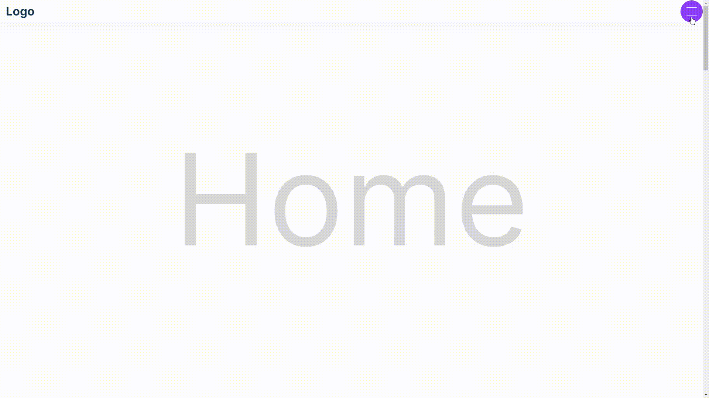
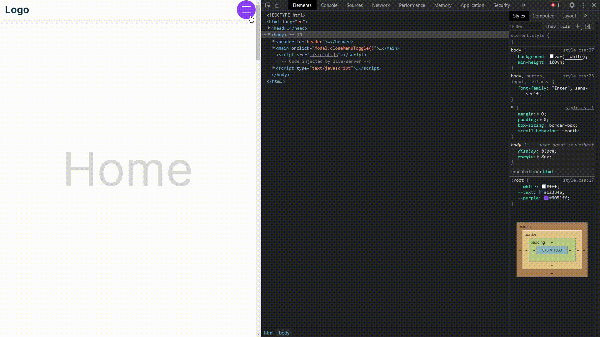

# Cretaing responsive navbar

## Prerequisites
To download this project you will need to install some things like:
* [Visual Studio Code](https://code.visualstudio.com/download) recommended
* [gitBash](https://gitforwindows.org/) recommended

## How to launch
* open index.html

Or

To start the project you will need to write this following line in the terminal
* cd ~/directory-of-archive/ - exemple: cd ~/Documents/responsive-navbar
* start index.html

## Built with
* HTML
* CSS
* Javascript

## Author
* Luiz Thiago F. dos Santos - [Github](https://github.com/Thiago-Fers7) and [LinkedIn](https://www.linkedin.com/in/luiz-thiago-096718206/)